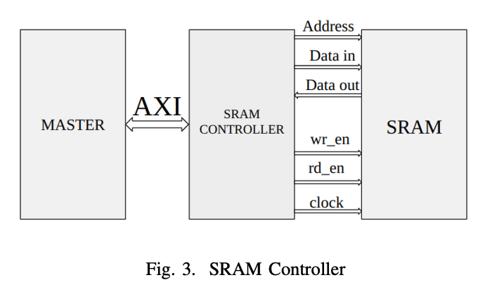
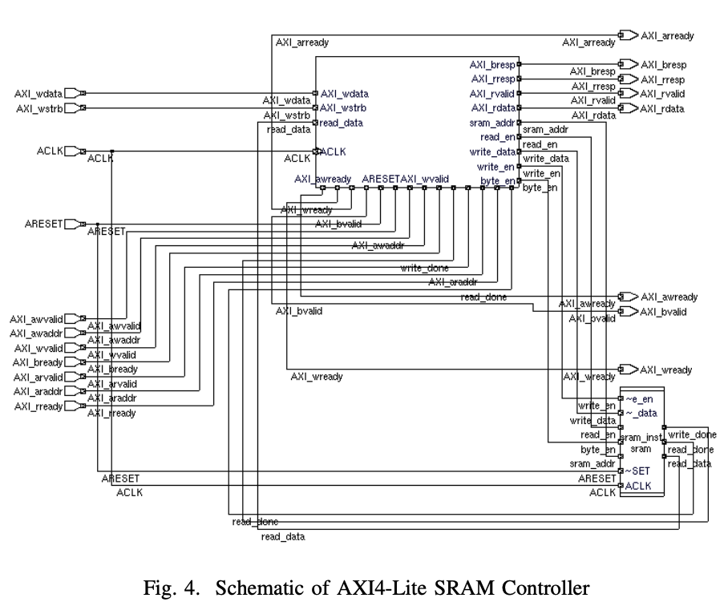

# AXI-Lite SRAM Controller

## 1. Introduction

The **AXI-Lite SRAM Controller** connects an **AXI4-Lite master** to an **SRAM memory module**.  
It allows reading and writing data to SRAM using the **AXI4-Lite protocol** while following the protocol’s **handshaking rules**.

The controller handles:
- 32-bit address space
- 32-bit data width
- Standard AXI4-Lite signals for read and write

The controller is designed for **simple, low-bandwidth memory access**.

---

## 2. Controller Design Overview

The controller has two main parts:

1. **AXI4-Lite Interface Controller**
   - Handles AXI signals like `awaddr`, `wdata`, `bresp`, `araddr`, `rdata`, etc.
   - Ensures proper handshaking and response generation
   - Sends addresses and data to SRAM

2. **SRAM Memory Module**
   - Stores 8-bit data
   - Supports 32-bit address range (full memory not used due to simulation limits)
   - Splits 32-bit data into four 8-bit chunks and stores them in consecutive addresses

---

## 3. AXI4-Lite Write Operation

The write process happens in three main steps:

1. **Address Transfer**
   - Master sends `AXI_awaddr` + `AXI_awvalid`
   - Controller checks if address is valid
   - Controller asserts `AXI_awready` to complete handshaking
   - Address is sent to SRAM

2. **Data Transfer**
   - Master sends `AXI_wdata` + `AXI_wstrb` + `AXI_wvalid`
   - Controller asserts `AXI_wready` after checking data validity
   - SRAM is enabled to write the data

3. **Write Response**
   - After SRAM finishes writing (`done` signal), controller checks `AXI_bready`
   - If ready, controller asserts `AXI_bvalid` and sends response `AXI_bresp = 2'b00` (OKAY)

---

## 4. AXI4-Lite Read Operation

The read process happens in two main steps:

1. **Address Transfer**
   - Master sends `AXI_araddr` + `AXI_arvalid`
   - Controller checks address and asserts `AXI_arready` for handshaking
   - Read enable is sent to SRAM

2. **Data Transfer**
   - SRAM outputs data along with `read_done`
   - Controller checks `AXI_rready`
   - If ready, controller asserts `AXI_rvalid`, sends data via `AXI_rdata`, and response `AXI_rresp = 2'b00` (OKAY)

**Note:** When no read or write occurs, response channel defaults to `2'b10`.

---

## 5. SRAM Memory Behavior

- Splits 32-bit write data into **four 8-bit chunks**
- Stores chunks in **four consecutive addresses**
- Read and write signals are controlled by the AXI-Lite interface
- Maximum simulation size used: 32 MB

---

## 6. Verification Focus (UVM Perspective)

To verify the AXI-Lite SRAM Controller:

- DUT = **AXI-Lite SRAM Controller**
- Tests focus on:
  - Correct handshaking (`VALID` + `READY`)
  - Correct address mapping
  - Data integrity during read/write
  - Proper response signals (`BRESP`, `RRESP`)
  - Reset behavior
  - Corner cases like invalid addresses or simultaneous operations

---

## 7. Summary

The AXI-Lite SRAM Controller:

- Bridges AXI4-Lite master to SRAM
- Supports 32-bit addresses and data
- Uses AXI4-Lite handshaking for reliable transfers
- Splits 32-bit data into 8-bit SRAM words
- Can be fully verified using UVM

---

