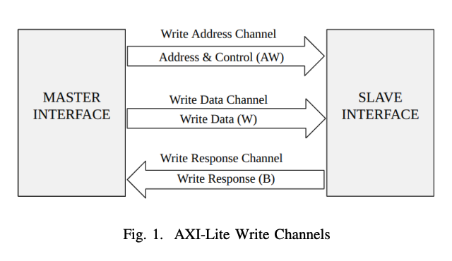
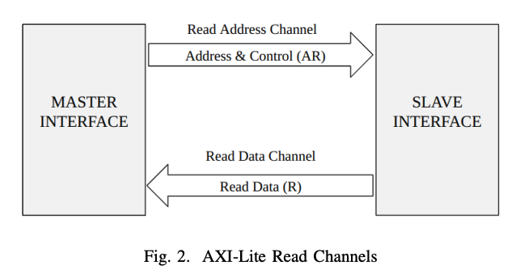

# AXI4-Lite Protocol

## 1. Introduction

AXI4-Lite is a **lightweight version** of the AXI4 (Advanced eXtensible Interface) protocol defined by ARM.  
It is mainly used for **simple, low-speed communication** in System-on-Chip (SoC) designs.

AXI4-Lite is commonly used to connect:
- Control registers
- Timers
- GPIOs
- SRAM controllers
- Simple peripherals

In this project, **AXI4-Lite is used as the interface between the master and the SRAM controller**.

---

## 2. Why AXI4-Lite?

AXI4-Lite is chosen because:

- It is **simple**
- It uses **less hardware resources**
- It supports only **single data transfers**
- It is easy to verify using UVM

### Key Simplifications Compared to AXI4

| Feature | AXI4 | AXI4-Lite |
|------|------|----------|
| Burst transfers | Yes | No |
| Data width | Up to 1024 bits | Usually 32 bits |
| Address width | Large | Usually 32 bits |
| Complexity | High | Low |

---

## 3. AXI4-Lite Channels Overview

AXI4-Lite uses **five independent channels** for communication between master and slave.

| Channel | Purpose |
|------|--------|
| Write Address (AW) | Carries write address |
| Write Data (W) | Carries write data |
| Write Response (B) | Indicates write result |
| Read Address (AR) | Carries read address |
| Read Data (R) | Carries read data and response |

These channels work **independently** but follow the same handshaking rules.

---

## 4. AXI4-Lite Write Operation

The write operation uses **three channels**.

### 4.1 Write Address Channel (AW)

This channel sends the **address** where data should be written.

**Main signals:**
- `AWADDR` – Write address
- `AWVALID` – Master says address is valid
- `AWREADY` – Slave says it is ready

When `AWVALID` and `AWREADY` are both high, the address transfer is complete.

 

---

### 4.2 Write Data Channel (W)

This channel sends the **actual data** to be written.

**Main signals:**
- `WDATA` – Write data
- `WSTRB` – Write strobe (which bytes are valid)
- `WVALID` – Data is valid
- `WREADY` – Slave is ready to accept data

`WSTRB` is used to support **byte-level writes**.

---

### 4.3 Write Response Channel (B)

After data is written, the slave sends a response.

**Main signals:**
- `BRESP` – Write response (OKAY or ERROR)
- `BVALID` – Response is valid
- `BREADY` – Master is ready to accept response

This channel confirms whether the write was successful.

---

## 5. AXI4-Lite Read Operation

The read operation uses **two channels**.

---

### 5.1 Read Address Channel (AR)

This channel sends the **address** from which data should be read.

**Main signals:**
- `ARADDR` – Read address
- `ARVALID` – Address is valid
- `ARREADY` – Slave is ready

---

### 5.2 Read Data Channel (R)

This channel returns the **read data** along with a response.

**Main signals:**
- `RDATA` – Read data
- `RRESP` – Read response
- `RVALID` – Data is valid
- `RREADY` – Master is ready to accept data

---

## 6. Handshaking Mechanism

The **handshaking rule** is the core concept of AXI4-Lite.

### Basic Rule:
> **A transfer happens only when both VALID and READY are high**

This applies to **all five channels**.

### Example:
- Master asserts `WVALID` with valid data
- Slave asserts `WREADY`
- Data transfer occurs in that cycle

This mechanism:
- Avoids data loss
- Supports variable latency
- Makes the protocol robust

---

## 7. AXI4-Lite in This Project

In this project:
- AXI4-Lite master sends read/write requests
- SRAM controller acts as AXI4-Lite slave
- Only single data transfers are supported
- No burst transactions are used

AXI4-Lite is ideal here because:
- SRAM control signals are simple
- Register-based access is sufficient
- Verification complexity is reduced

---

## 8. Verification Focus (UVM Perspective)

While verifying AXI4-Lite, we check:
- VALID/READY handshakes
- Correct address transfer
- Proper data transfer
- Correct response values (`BRESP`, `RRESP`)
- Reset behavior
- Protocol timing rules

---

## 9. Summary

- AXI4-Lite is a simplified AXI protocol
- Uses five channels
- Supports only single read/write transfers
- Ideal for low-bandwidth peripherals like SRAM controllers
- Easy to implement and verify using UVM

---

